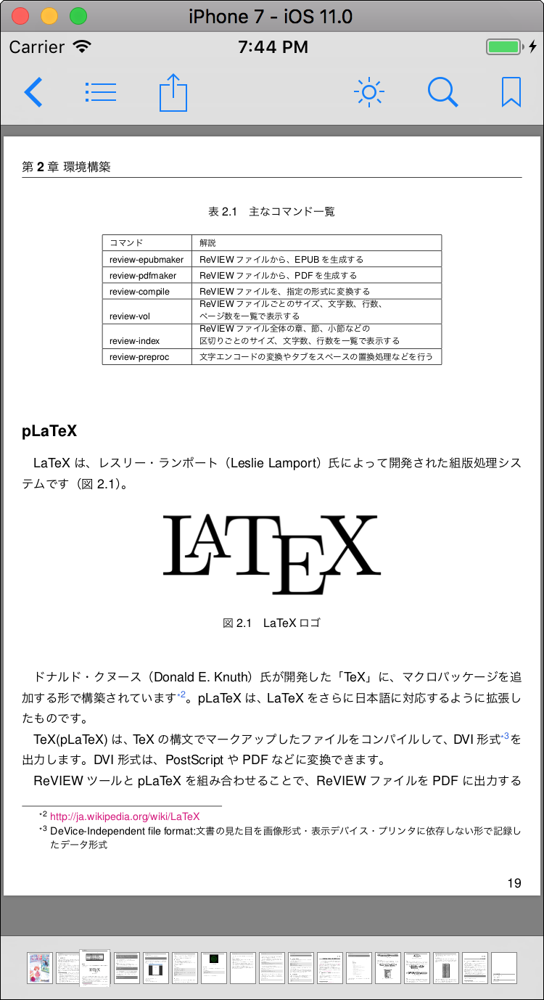
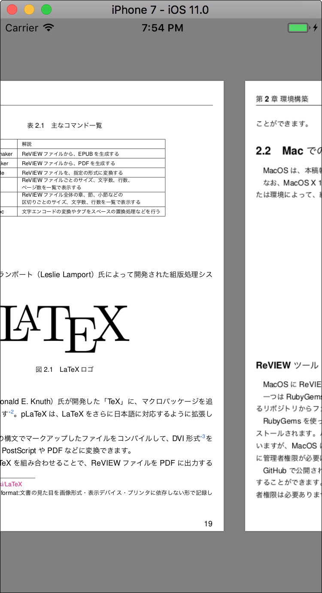
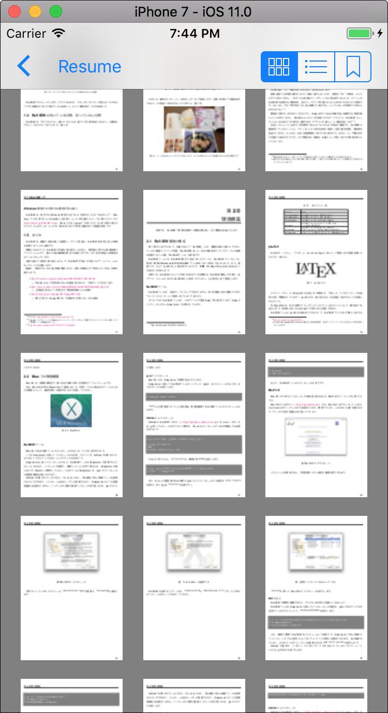
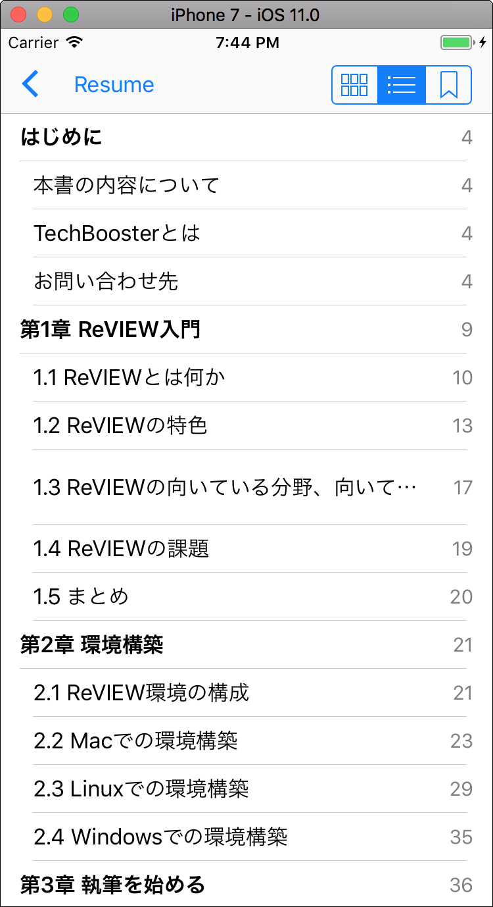
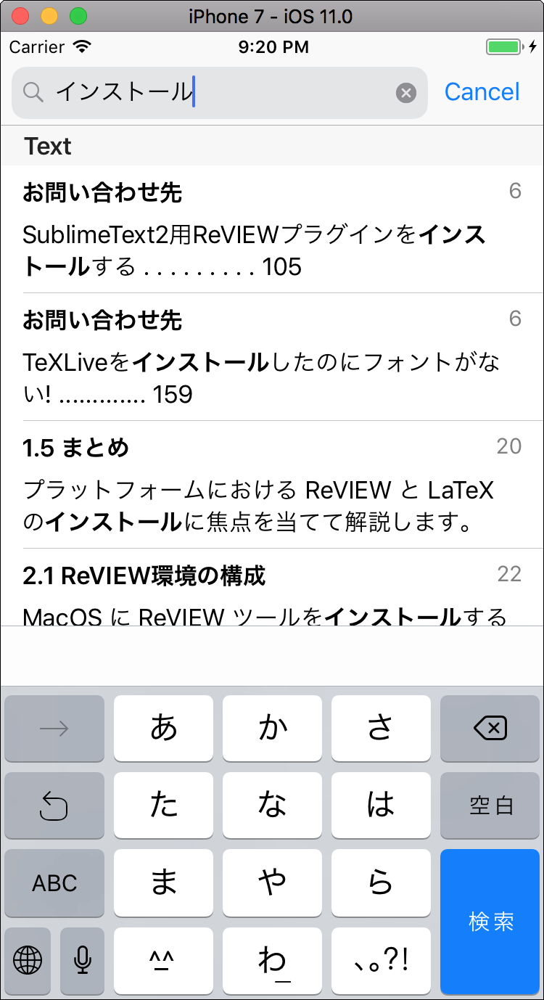
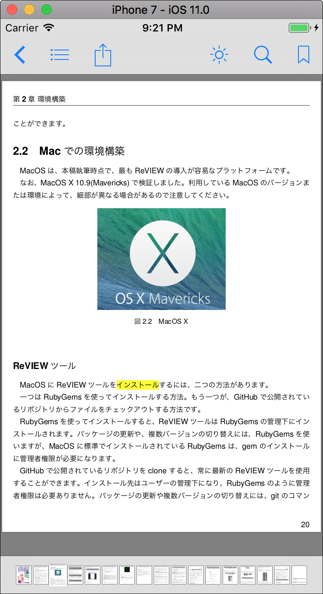
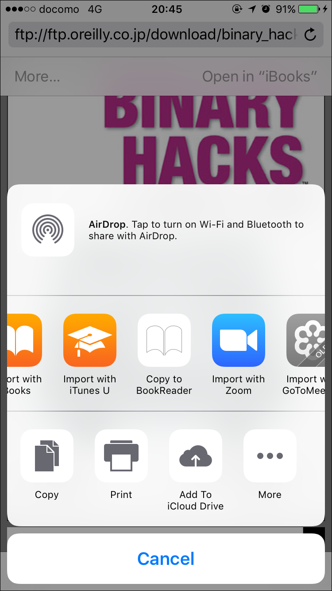

# BookReader
Sample code for PDFKit on iOS 11, clone of iBooks.app built on top of PDFKit.

----------------

</img>&nbsp;</img> 
</img>&nbsp;
</img> 
</img>&nbsp;
</img>

## Requirements
iOS 11.0 and Xcode 9

## Usage
### Import Your Own PDFs

The easiest way to import your PDFs is to email your PDF file to your iOS device. Navigate to the email and ensure that the attachment is there. Tap and hold the document attachment icon. This should open a popover on the iPad, or an action sheet on the iPhone, that shows all of the apps that open your document type. BookReader app should show up in the list. Tap BookReader app icon and BookReader app should launch and receive the document from the email.

</img>

## Author
Kishikawa Katsumi, kishikawakatsumi@mac.com

## License
BookReader is available under the MIT license. See the LICENSE file for more info.
